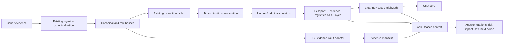

# 0G integration plan: Evidence Vault and Ask Usance

Status: **proposed**. This is an implementation plan, not a claim that 0G is integrated.

## Decision

Usance will use 0G in two narrowly-scoped places:

1. **Usance Evidence Vault** uses 0G Storage as an optional, cryptographically bound archive for
   the raw issuer evidence behind an Asset Passport.
2. **Ask Usance** uses 0G Compute as one bounded AI path for evidence extraction and for a
   contextual, read-only explanation assistant.

The product does **not** add a generic chatbot, autonomous trading agent, personal-agent NFT,
0G DA integration, or an AI authority over a user's funds. The existing rule remains unchanged:

> AI interprets reality. Deterministic code controls money.

0G is an application-level dependency. Usance remains an X Layer protocol; it does not imply an
onchain bridge, a cross-chain asset transfer, or an endorsement by either network.

## Why this belongs in Usance

RWA holders face a gap between a token's displayed balance and its usable financial value. They
need to understand the legal claim, transfer restrictions, redemption conditions, freshness of the
supporting evidence, and the realistic exit value under stress. A token can be visible onchain yet
still be hard to transfer, redeem, or safely lend against.

Usance already solves the financial half of this problem: a versioned Asset Passport and a
deterministic risk engine decide what value the protocol may recognise. 0G adds two useful
properties without changing that decision:

- a durable, integrity-bound location for the underlying evidence; and
- a constrained way for a user to ask why the deterministic result is what it is.

The launch statement is:

> **Usance turns RWA documents into auditable capital. 0G preserves the evidence, AI makes it
> understandable, and X Layer contracts enforce the risk.**

## Non-negotiable boundaries

| Area | Permitted | Forbidden |
|---|---|---|
| 0G Storage | Store a document manifest and approved public issuer evidence | Treat a storage root as proof that an issuer document is true, current, or legally valid |
| Private data | Client-side encrypted storage only after a dedicated security and legal review | Plaintext KYC, wallet profiles, bank/custody records, user chats, or unredacted private agreements |
| 0G Compute | Propose quoted claims, find contradictions, explain existing data, run simulations through the existing deterministic preview | Set LTVs/haircuts, mutate a Passport, call a wallet, approve a token, borrow, withdraw, or claim an asset is safe |
| Ask Usance | Explain the connected user's current state with citations and safe next actions | General market chat, price predictions, investment advice, unsupported legal/compliance advice, or autonomous action |
| Corroboration | Count 0G as one named, independently configured extractor path when its model/provider qualifies | Count two prompts, model retries, or two routes through the same provider as independent evidence |

An unavailable 0G service must degrade to the existing deterministic parser / existing document
archive. It must never fabricate a second opinion or make a Passport appear corroborated.

## Architecture



The important direction is one-way: 0G output may inform a proposal or explain an already-computed
result. It does not obtain a path into `ClearingHouse`, `RiskPolicyRegistry`, wallet clients, or an
`ADMISSION` signing key.

## Part 1 — Usance Evidence Vault

### User outcome

On an Asset Passport or proof receipt, a reader can see that the exact evidence used by Usance is
available and cryptographically bound to the Passport. They can distinguish:

- **Document committed:** these exact bytes are archived and match the stated hash.
- **Claim corroborated:** independent extraction paths agreed on the relevant fields.
- **Passport admitted:** an authorised admission process committed a specific version on X Layer.

Those statements are deliberately separate. The first does not imply the second or third.

### Data flow

1. The existing `ingest()` function receives issuer evidence, checks the origin and source class,
   stores verbatim bytes through `ObjectStore`, and derives raw and canonical hashes.
2. A new `ZeroGObjectStore` implements the existing `ObjectStore` interface for **approved public
   evidence only**. It uploads the raw bytes to 0G Storage and returns ordinary Usance metadata.
3. A separate `EvidenceArchiveManifest` records the Usance raw digest, canonical content hash,
   evidence ID, media type, 0G root, object size, upload time, visibility, and adapter version.
4. The manifest is content-addressed and its digest is retained in offchain proof records. The
   current Solidity registry remains unchanged for the MVP: it already commits the evidence ID and
   hashes that financial logic relies on.
5. Retrieval verifies the downloaded bytes locally against the stored Usance raw digest before any
   document is displayed or extracted. A root mismatch, missing object, or failed decrypt is a
   retrieval failure, never a substituted document.

### Why the manifest is separate from `EvidenceRegistry`

`EvidenceRegistry` is a minimal onchain audit commitment. Adding 0G locations to it would make
storage-provider availability and change cadence part of the financial protocol surface. The MVP
uses an offchain manifest linked by existing content hashes. Only propose an onchain archive-root
field after it is required by a concrete verifier and after migration/versioning is designed.

### Data classification

| Class | MVP policy | Later policy |
|---|---|---|
| Public prospectus, issuer terms, public repurchase notice | Eligible for plaintext archival after rights review | Same |
| Public reserve attestation | Eligible if the issuer permits copying | Same |
| Licensed or non-public issuer evidence | Do not upload in MVP | Client-side encrypt before upload; access is time-bound and auditable |
| User portfolio, wallet activity, chats, KYC/KYB, bank/custody data | Never upload | Remain out of scope unless a separate privacy, deletion, access, and key-recovery design is approved |

### Components and changes

| Component | Change |
|---|---|
| `services/evidence/src/store.ts` | Add `ZeroGObjectStore`; preserve `put/get/head` semantics, content-derived keys, idempotency, and null-on-miss behaviour. |
| `services/evidence/src/archive.ts` | Add manifest schema, archive creation, local digest verification, and public/private eligibility gate. |
| `packages/schemas/src/` | Add strict manifest and archive-proof schemas. No arbitrary provider metadata reaches candidate claims. |
| `services/evidence/src/pipeline.ts` | Accept the 0G store through the existing dependency injection path; do not make archive upload a prerequisite for deterministic parsing in the first release. |
| `proof/` and receipt generation | Record the manifest digest and archive status as evidence, not as a financial input. |
| Asset Passport / proof UI | Render archive availability, manifest version, and verified retrieval state. Never label this simply “verified.” |

### Failure behaviour

| Failure | Behaviour |
|---|---|
| 0G upload fails before archive is acknowledged | Keep the existing durable store as source of truth; mark archive `PENDING` or `UNAVAILABLE`; do not change the Passport. |
| 0G returns bytes with wrong digest | Refuse display/extraction; create an operator alert; never silently fall back to unverified bytes. |
| 0G is unavailable at read time | Display the onchain commitment and last known archive status; the Passport and risk engine remain usable. |
| Private document is submitted | Reject before upload in MVP. |

## Part 2 — 0G Compute Evidence Worker

### Purpose

The worker is a second model-backed extraction path, not a replacement for the deterministic parser
or the existing ChainGPT path. It reads an already canonicalised document and produces only the
strict `ModelExtraction` shape already used by Usance:

```text
issuer, asset, report date, custodian, redemption terms,
transfer restrictions, backing claims, source quote, conflicts, missing fields
```

### How it works

1. `runPipeline()` canonicalises the document before the worker sees it.
2. `ZeroGComputeEvidenceExtractor` receives the canonical document and the existing field/kind
   allowlist. It cannot propose policy parameters or free-form state changes.
3. It calls a configured 0G Compute model via the supported SDK/API and validates the returned JSON
   with `modelExtractionSchema`.
4. Usance attaches all provenance itself: evidence ID, source class, timestamps, offsets, and the
   document quote check. A missing or non-verbatim quote drops the claim.
5. The worker records model ID, provider/route, request and response digest, and any available
   0G verification artefact in the extraction attestation.
6. `DeterministicCorroborator` compares normalised fields across genuinely independent groups.
   Disagreement on a risk-bearing field produces `CLAIM_CONFLICT`; it does not choose a winner.
7. The pipeline still stops at unsigned calldata. An admission actor, not the worker, performs any
   onchain commit.

### Independence policy

The worker has an `independenceGroup` based on its actual provider and model route, not its class
name. If 0G routes to the same underlying provider/model as an existing path, both extractors share
one group. The product must prove configuration separation before calling it a second independent
opinion.

0G’s execution/routing attestation can show where an inference was served. It does not establish
that the answer is true, that the document is authentic, or that the model is suitable for credit
decisions.

### Components and changes

| Component | Change |
|---|---|
| `packages/zerog/` | New isolated client package for Storage and Compute configuration, transport, versioning, and response verification. No wallet or protocol imports. |
| `packages/zerog/src/evidence-extractor.ts` | Implement `EvidenceExtractor` using the current Usance field allowlist and quote requirements. |
| `packages/schemas/src/evidence.ts` | Extend the extraction attestation schema with optional provider-route and response-digest fields. |
| `services/evidence/src/extract.ts` | Register the worker behind feature configuration. A missing 0G credential means this extractor is absent, not an empty success. |
| `services/evidence/test/` | Add malformed response, prompt injection, no-credential, quote mismatch, same-provider independence, timeout, and verification-failure tests. |

## Part 3 — Ask Usance: floating, contextual, and useful

### Product decision

Ask Usance is **not a page** and not a freeform crypto chatbot.

It is a small floating control at the lower-right of authenticated app routes. On hover/focus it
reads **“Ask Usance”**. On click it opens a compact, dismissible side panel above the control. On
mobile it opens a bottom sheet with the same scoped experience.

It is contextual rather than universal:

| Surface | What it understands | Starter prompts |
|---|---|---|
| Overview | Current holdings, debt, health, current epoch | “Why is my capacity this amount?”; “What changed?” |
| Borrow / withdraw | Exact deterministic quote, binding constraint, current epoch | “Why is this amount refused?”; “What is the safer amount?” |
| Asset / Passport | Current and previous Passport, source quotes, expiry, archive state | “What do I own?”; “Show the clause behind this restriction.” |
| Alerts | The alert and its evidence/risk cause | “What should I do first?” |

No wallet means no position-specific answers. The control may still explain a public Asset Passport,
but it must not create a portfolio profile from an address typed into chat.

### Answer contract

Every response renders four fixed sections:

1. **Answer** — direct, short plain-language result.
2. **Evidence** — Passport version, relevant document quote, source link, and as-of time.
3. **Risk impact** — a value from the existing deterministic preview, marked as a simulation where
   applicable.
4. **Next action** — one of: read evidence, simulate, repay, add collateral, wait for liquidity,
   or contact the issuer. Transaction actions navigate to existing flows; they do not execute.

The model never invents a number. Numeric content comes from `packages/domain` or a read from the
same X Layer contract state used by the page. The model's task is choosing and explaining a cited
answer, not calculating risk.

### Context and privacy

The client builds a minimal, structured context envelope from data already displayed in the app:

```text
route, chain ID, current risk epoch, deterministic risk result,
selected asset/Passport version, evidence summaries and citations,
visible alert codes, user question
```

Do not send seed phrases, signatures, raw private documents, session tokens, or broad wallet history.
The default is no persistent chat memory. A conversation ends when the panel closes or after a short
server TTL. 0G KV is explicitly out of scope for user memory in this release.

### Tool boundary

Ask Usance may call read-only tools only:

- `getAccountHealth`
- `getQuote`
- `getPassport`
- `comparePassportVersions`
- `getEvidenceQuote`
- `simulateRepay`
- `simulateAddCollateral`

There are no `borrow`, `withdraw`, `approve`, `sign`, `commitPassport`, or arbitrary-RPC tools.
The only way to take an action is for the user to leave the panel, review the normal flow, and sign
their own transaction.

### Components and changes

| Component | Change |
|---|---|
| `apps/web/components/ask-usance.tsx` | Floating trigger, hover/focus label, accessible dialog/panel, mobile bottom sheet, route-aware starter prompts. |
| `apps/web/components/app-shell.tsx` | Mount the control only inside the authenticated app shell and pass a narrow route context. |
| `apps/web/lib/ask-usance-context.ts` | Build and validate the structured context envelope. Do not pass raw page HTML or arbitrary client state. |
| `apps/web/app/api/ask-usance/route.ts` | Authenticate the session, enforce rate limits and size limits, resolve read-only tools, call configured 0G Compute, and validate a structured answer. |
| `packages/schemas/src/ask-usance.ts` | Strict request, tool-result, citation, and answer schemas. |
| `apps/web/test/` | Test citation requirements, unavailable evidence, stale epoch, no-wallet mode, prompt injection, tool allowlist, and a response that tries to issue a transaction. |

## Delivery order

### Phase A — foundation and proof

1. Add `@usance/zerog` with explicit `disabled`, `testnet`, and `mainnet` configuration.
2. Implement `ZeroGObjectStore` and the archive manifest against a 0G test environment.
3. Add byte-for-byte retrieval verification and negative tests.
4. Add the archive status to an existing public Passport/proof surface.

**Exit criterion:** a public fixture document can be archived, retrieved, and independently checked
against the existing Usance raw digest; a missing or mismatched object is visibly refused.

### Phase B — compute worker

1. Implement `ZeroGComputeEvidenceExtractor` as an optional extractor.
2. Record provider/model/version/attestation metadata.
3. Verify the same-provider rule and all conservative failure paths.
4. Run it beside the existing deterministic parser on the canonical RWA fixtures.

**Exit criterion:** the worker can never create a Passport candidate without schema validation,
verbatim quotes, deterministic corroboration, and an external admission signature.

### Phase C — Ask Usance

1. Define answer and citation schemas before building the panel.
2. Build the lower-right trigger and contextual panel for `/app`, borrow, withdraw, assets, and
alerts.
3. Add only the six read-only tools listed above.
4. Connect safe action cards to existing normal routes.
5. Add visual, keyboard, screen-reader, and mobile acceptance tests.

**Exit criterion:** a user can ask why capacity changed, see the exact evidence and deterministic
impact, and reach a safe remediation flow—without the assistant having transaction capability.

## Verification and launch evidence

Before describing the integration publicly, produce:

- a 0G archive root and a successful byte-for-byte retrieval check for a public evidence fixture;
- a record of the configured model/provider/route and a sample verified extraction;
- a prompt-injection fixture proving unsupported instructions cannot create a state-changing tool
  call or a risk parameter;
- a recorded `CLAIM_CONFLICT` case that restricts rather than silently selects a reading;
- an Ask Usance recording that answers “Why can I borrow only $833?” with citations and a
  deterministic simulation;
- a statement of storage visibility, document rights, retention, and data excluded from the
  integration.

## Explicitly deferred

- Storing private user memory or portfolio history in 0G KV.
- Fine-tuning a model on issuer or user documents.
- 0G DA integration.
- Agentic ID / a transferable personal agent.
- Autonomous borrowing, trading, liquidation, or wallet signing.
- Claims of compliance, legal validation, issuer truth, or 0G/X Layer partnership without separate
  written evidence.

## External references

- [0G Storage SDK](https://docs.0g.ai/developer-hub/building-on-0g/storage/sdk)
- [0G Compute inference](https://docs.0g.ai/developer-hub/building-on-0g/compute-network/inference)
- [0G documentation](https://docs.0g.ai/)
- [Usance AI boundary](AI_BOUNDARY.md)
- [Usance architecture](ARCHITECTURE.md)
- [Usance evidence model](../spec/evidence-model.md)
