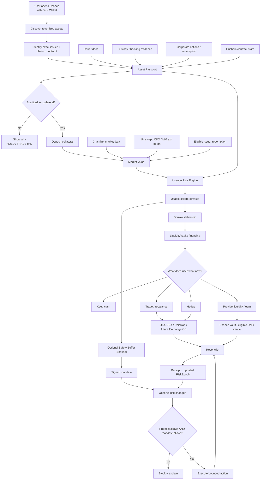

# Usance × X Layer and OKX: Turning Tokenized Assets Into Usable Capital

## Executive summary

**My bias: LOCK the core Usance thesis, but REVISE the immediate market wedge.**

Usance should not position itself as “another RWA protocol”, “an AI RWA verifier”, or “a lending protocol for tokenized stocks”. The stronger position is:

> **Usance is the capital-admission and clearing layer for tokenized assets.**
>
> It determines what an asset actually represents, what evidence supports it, how much of its value is realistically recoverable, how much credit can safely be extended against it, and what automated actions can occur within hard user-defined limits.

That is materially different from tokenisation, a wallet, a DEX or a lending market. Your canonical product specification already has the right architecture: **Evidence → Asset Passport → deterministic risk → ClearingHouse → financing/execution → reconciliation**, with X Layer as the canonical collateral, obligation and settlement domain. fileciteturn0file2 The AI boundary is also correctly drawn: AI proposes facts from evidence; it cannot set LTVs, move collateral, advance risk epochs or commit Passports. fileciteturn0file3

The new research materially strengthens the thesis. X Layer now has several pieces that were previously only roadmap assumptions: Uniswap is live, Aave is live, Chainlink Data Streams is live on mainnet with equities, Treasury and commodity data, xStocks' issuer documentation now explicitly lists **X Layer as a supported blockchain**, BitGo is X Layer's preferred custodian for its token standard, and X Layer is positioning Exchange OS around shared-liquidity spot, perpetual and outcome markets. citeturn12search1turn12search2turn12search5turn9search5turn8search1turn14view2

That means one of the blockers in your own Sentinel task ledger is already becoming stale: it says xStocks admission is blocked pending issuer confirmation of X Layer deployment. fileciteturn0file7 Backed's current primary legal documentation now explicitly lists X Layer among supported xStocks networks, while its developer documentation says exact per-token/per-chain contract addresses are available through the Assets API. This does **not** mean you should blindly admit `NVDAx` or `TSLAx`; it means the next action is exact-contract verification and automated registry ingestion rather than waiting to establish whether X Layer support exists at all. citeturn9search5turn10search12

There is another crucial discovery. **“Tokenized stocks on OKX” is not one homogeneous asset class.** OKX's current tokenized-stock FAQ says its current third-party provider in that flow is Ondo and warns that token structure, fees, corporate-action treatment and rights vary by provider. At the same time, OKX DEX's stock-token promotion explicitly lists both `TSLAx/AAPLx/NVDAx` and `TSLAon/AAPLon/NVDAon`. citeturn11search0turn11search11 That heterogeneity is almost a perfect demonstration of the Usance problem: **two tokens may both say “Tesla”, while representing different legal structures, issuers, chains, redemption mechanisms and holder rights.**

This is therefore the problem I would make Usance own:

> **The industry knows how to put assets onchain. It does not yet have a universal way to decide when those assets become safe, financeable, reusable capital.**

X Layer supplies the execution environment. OKX supplies distribution and trading surfaces. Issuers such as xStocks and Ondo supply tokenized assets. Chainlink supplies market observations. Custodians such as BitGo supply parts of the trust chain. Uniswap/Aave/Exchange OS supply potential liquidity and capital venues.

**Usance is the layer that connects those primitives into a controlled capital lifecycle.**

The flywheel is not simply:

`RWA → DEX pool`

It is:

**RWA → Passport → recognised collateral → credit → trade/hedge/LP → repayment → collateral capacity restored → capital reused.**

That is exactly the capital-recycling loop already defined in the canonical Usance PRD. fileciteturn0file2

The timing is unusually favourable. Your supplied X Layer programme material says the AI Season requires AI plus X Layer deployment, while the RWA incentive programme is explicitly paying for deeper RWA/stablecoin and RWA/ecosystem-token liquidity. The launch component measures qualifying OKX DEX **Interface** volume rather than API volume, and the separate RWA liquidity initiative measures Uniswap pool liquidity. fileciteturn0file0 The hackathon-operator criteria you supplied say sponsor infrastructure should be load-bearing rather than decorative; Usance passes that test if X Layer genuinely owns collateral/obligation state and OKX/X Layer venues genuinely become execution/liquidity routes. fileciteturn0file1

**The main thing I would not do is broaden the product now.** Do not start by supporting every RWA, every chain, every venue and every Sentinel. Launch the institutional architecture behind one brutally simple user outcome:

> **“I own an eligible tokenized asset. Tell me what it really is, tell me how much of it is safely usable, and let me get liquidity without selling it.”**

That is your wedge.

## Product-to-platform fit

### The missing layer in the X Layer stack

X Layer calls itself an EVM Layer 2 for onchain financial markets. Its Exchange OS architecture explicitly separates the roles: X Layer EVM anchors assets and governance while TradeZone is designed for high-frequency matching and execution; Exchange OS is intended to support spot, perpetual and outcome markets with shared liquidity. citeturn14view2turn12search3

Usance fits **between asset issuance and market execution**:

| Layer | Existing platform/provider | What it does | What Usance adds |
|---|---|---|---|
| Asset issuance | xStocks, Ondo and future issuers | Creates tokenized financial exposure | Normalises what each token legally/economically represents |
| Wallet/discovery | OKX Wallet/Market/DEX | Makes tokenized assets discoverable, holdable and tradable | Adds “What is this?” and “How much is usable as capital?” |
| Asset truth | Issuer docs, custody reports, onchain state | Raw evidence | Versioned Asset Passport with provenance |
| Price | Chainlink Data Streams | Underlying/market observations | Combines price with liquidity, redemption and asset-status policy |
| Liquidity | Uniswap, OKX DEX, market makers | Gives a tradeable exit | Models **executable exit value**, not merely last price |
| Lending | Aave and Usance financing | Provides capital | Usance specialises in heterogeneous RWA admission and risk-aware recognition |
| Settlement | X Layer EVM | Canonical onchain state | ClearingHouse owns collateral, debt, reservations, mandates and risk epochs |
| Advanced execution | Exchange OS / TradeZone as access expands | Spot/perp/outcome execution | Adapter + capital reservation + independent reconciliation |
| Automation | OKX AI tooling / generic agents | Can construct actions | Sentinels execute only inside protocol policy **and** signed user mandates |
| Attribution | X Layer Builder Codes | Tracks app-driven activity | Usance can prove contributed transactions/users/conversions |

X Layer's current infrastructure makes this particularly credible. Mainnet is chain ID **196**, testnet **1952**, and OKB is the native gas token. citeturn14view0 The Jovian upgrade set the minimum base fee at 0.02 Gwei; OKX reports roughly $0.0001 for a standard ERC-20 transfer, making repeated risk and settlement interactions inexpensive enough that Usance need not optimise around Ethereum-mainnet-style transaction costs. citeturn12search0

Chainlink Data Streams became a much more important part of this architecture in June 2026 because OKX says the X Layer mainnet integration provides pull-based market data including 24/5 US equity streams such as TSLA, NVDA and AAPL, tokenized Treasury pricing and gold/silver data. citeturn12search5 That is extremely aligned with Usance, **provided you maintain the boundary that price truth is not legal truth**.

### Why the tokenized-stock market makes Passports more valuable, not less

Look at the current OKX experience carefully. OKX says tokenized stocks are third-party products and that provider-specific token structure, mechanics, fees, rights and corporate-action treatment can differ. Its current FAQ identifies Ondo in that particular flow. citeturn11search0 Yet OKX DEX also publicly lists both xStocks-style symbols and Ondo-style symbols in its stock-token trading coverage. citeturn11search11

Then compare xStocks. Backed describes xStocks as tracker certificates, fully collateralised 1:1, with the underlying securities held through custodial structures; they do not confer ordinary shareholder voting rights. citeturn9search6turn10search10 Corporate actions are reflected through a rebasing/multiplier mechanism, and issuance/redemption differs from secondary 24/7 trading. citeturn10search1turn10search11

That means a generic UI row labelled `NVDA` or `TSLA` is insufficient for finance.

The Usance Passport should make the difference explicit:

| Question | Why it matters to a trader | Why it matters to Usance credit |
|---|---|---|
| Who issued this token? | Counterparty/structure | Issuer-risk policy |
| What exactly is the holder entitled to? | Economic rights | Recovery assumptions |
| Who holds the underlying? | Backing confidence | Custody haircut |
| Can the holder redeem? | Exit alternative | Redemption floor |
| Who is actually eligible to redeem? | Practical liquidity | Do not credit an unusable theoretical exit |
| What chain/contract is authoritative? | Avoid wrong asset | Admission is address-specific |
| What happens to dividends/splits? | Correct balance | Correct collateral accounting |
| When is underlying liquidity open? | Off-hours spread | Session-aware haircut |
| How deep is the actual onchain market? | Slippage | Liquidation capacity |
| Is the evidence fresh? | User confidence | Capability and LTV gates |

This is the first major GTM insight: **Usance should market the Passport less as “verification” and more as the financial translation layer between a token and capital markets.**

“Verification” sounds like due diligence software.

“**This Passport tells every lender, market maker and agent what this token can safely be used for**” sounds like infrastructure.

### What actually generates the liquidity loop

A common misconception is that Usance needs to manufacture liquidity. It does not. It needs to make existing assets and liquidity **more reusable**.

Suppose a holder has $100,000 market value of a tokenized equity.

Usance may recognise only $55,000 after issuer, volatility, liquidity, market-session and settlement haircuts. A lender may permit $35,000 of debt. The holder borrows $20,000 USDC/USDT without selling the equity. That stablecoin can then enter an X Layer pool, pay for another asset, fund a hedge or remain liquidity. Interest is paid to capital providers. As debt is repaid, capacity becomes reusable.

The token has therefore generated economic activity without needing to be sold.

The metric I would optimise is not simply TVL. It is:

\[
\text{Capital Velocity}
=
\frac{\text{settled financing + financed execution volume}}
{\text{average recognised collateral}}
\]

Alongside it, track **recognised collateral, credit utilisation, executable exit coverage, realised liquidation slippage, repeat financing cycles per account, LP utilisation and Builder-Code-attributed transactions/users**. Builder Codes exist specifically to attribute transactions, acquisition and conversion to an application, making this an unusually useful ecosystem KPI for Usance. citeturn15search0turn15search4

This is how the pitch to X Layer evolves from “we bring TVL” to:

> **“Usance increases the number of economic actions each dollar of RWA TVL can safely generate.”**

That is a substantially better chain-level value proposition.

## Technical integration and mainnet architecture

### The contract architecture is directionally right

The canonical Usance specification already contains the correct separation: `AssetRegistry`, `EvidenceRegistry`, `PassportRegistry`, `RiskPolicyRegistry`, `ClearingHouse`, `CollateralVault`, `LiquidityVault`, `FinancingEngine`, `LiquidationManager`, `MandateRegistry`, `IntentBook`, `DelegationGateway`, `FeeController` and `EmergencyController`, with integration-specific complexity kept behind adapters. fileciteturn0file2

Your current completion ledger says most of that core is already implemented, including fixed-point accounting, versioned evidence/Passport commitments, collateral/borrow/repay/withdraw, financing, liquidation, EIP-712 mandates and delegated authority. It also documents substantial test coverage and multiple live-testnet proof categories at the repository snapshot it describes. fileciteturn0file8

There is, however, a discrepancy worth resolving immediately: **your message says you currently regard the build as local/testnet-preparation, while the repository ledger records LIVE_TESTNET proofs.** Before public claims or mainnet promotion, re-run the claim ledger and verify every referenced transaction against the current deployment. A stale proof file should never become marketing copy simply because the checklist once called it live. That is consistent with the evidence discipline in your own operator methodology. fileciteturn0file1turn0file8

### Required contracts and integrations

| Component | Role | Current Usance position | Mainnet requirement |
|---|---|---|---|
| `AssetRegistry` | Canonical asset/address/capability identity | Built | Mainnet addresses populated only from authoritative provider sources |
| `EvidenceRegistry` | Hash/provenance commitments | Built | Mainnet signer/role policy and evidence-retention procedure |
| `PassportRegistry` | Versioned asset facts | Built | Asset-by-asset production Passport approval workflow |
| `RiskPolicyRegistry` | Haircuts, thresholds, risk epochs | Built | Conservative production parameters + governance delay |
| `CollateralVault` | Holds admitted collateral | Built | **Rebase-aware xStocks accounting must be proven** |
| `ClearingHouse` | Canonical collateral/debt/reservation state | Built | Audit/frozen scope, production roles and low initial caps |
| `LiquidityVault` | Supplies settlement capital | Contract exists | Wallet LP deposit/withdraw is still a P0 product gap in your checklist |
| `FinancingEngine` | Credit and interest | Built | Production rate model; wire outstanding origination-fee gap |
| `LiquidationManager` | Progressive recovery | Built | Real mainnet routes/depth, not test fixtures |
| `MandateRegistry` | EIP-712 delegated authority | Built | Browser lifecycle completion and production signer policy |
| `DelegationGateway` | Bounded agent execution | Built | Keep no-withdrawal constraint |
| `IntentBook` | Reservation/reconciliation | Built | Real venue adapter path |
| `ChainlinkStreamsAdapter` | Market observations | Planned architecture | Verify production stream IDs/freshness policy asset by asset |
| `XStocksAdapter` | Contract/issuer/corporate-action semantics | Planned | Pull exact X Layer addresses and multiplier state from issuer sources |
| `OkxDexAdapter` | Quote/swap/liquidity route | External integration | Separate API execution from grant-qualifying Interface handoff |
| `ExchangeOSAdapter` | Advanced markets | Access-dependent | Keep behind `ACCESS_REQUIRED` until production interface is available |
| `RemoteCollateralAdapter` | Cross-chain collateral | Not complete | Post-launch only; LayerZero path/security config |
| Sentinel registries/runtime | Bounded autonomous strategies | Largely built locally | Live end-to-end autonomous testnet proof still open |
| ERC-8021 client suffix | X Layer attribution | Checklist says built | Verify every production write has current Builder Code |

Your master checklist specifically records wallet/X Layer connection and ERC-8021 attribution as done, while the OKX DEX and Exchange OS venue surfaces remain incomplete or externally constrained. fileciteturn0file8 X Layer's current Builder Code documentation confirms that the attribution suffix requires no contract modification, can be configured via Viem/Wagmi `dataSuffix`, and that automatic OKX Wallet injection is not yet available, so Usance itself should continue appending it. citeturn15search0turn15search4

### The most important new contract issue: rebasing tokenized stocks

This deserves P0 status before you put xStocks into a vault.

xStocks documentation says corporate actions such as dividends and splits modify token balances through its multiplier mechanism. On EVM networks, `balanceOf()` reflects the adjusted balance automatically. The issuer explicitly warns integrators to handle rebasing correctly and recommends a brief pause around multiplier activations. citeturn10search5turn10search6

That creates a subtle but serious problem for any collateral vault that internally stores:

```text
userDepositedAmount = amount at deposit time
```

and assumes that amount never changes.

Imagine two users deposit 50 xStocks each. The vault receives 100. A corporate action changes the effective vault balance to 102. If Usance's internal user ledgers remain `50 + 50`, there are now two unassigned units. A reverse adjustment can create the opposite problem.

**Do not admit a rebasing RWA until this invariant is solved.**

The clean pattern is one of:

1. **Per-asset vault shares:** users own proportional shares of the vault's live `balanceOf`, similar conceptually to share-based accounting.
2. **A rebase-aware adapter/index:** user claims are recorded against a canonical index/multiplier, with every valuation and withdrawal transformed deterministically.
3. **A provider-native non-rebasing representation**, only if the issuer offers one and its rights are identical.

I favour **share-based collateral accounting behind an asset adapter**, because future rebasing/tokenised-fund assets will present the same class of problem.

Also add a corporate-action gate:

```text
pending multiplier activation
        ↓
NO_NEW_RISK
        ↓
brief interaction window / confirm new balance
        ↓
new Passport + new RiskEpoch
        ↓
resume
```

The issuer publishes multiplier state and activation metadata through its API/onchain interfaces, so this can be deterministic rather than AI-driven. citeturn10search6turn9search9

### Oracle architecture: three truths, not one oracle

I would make this explicit in the architecture.

**Market truth** answers: *what can it trade for?*

Chainlink Data Streams is the primary candidate on X Layer for underlying equities/Treasuries/commodities. citeturn12search5

**Asset truth** answers: *what is this token and what rights does it represent?*

That comes from issuer documentation, exact contract identity, custodian/backing evidence, corporate-action state and the Asset Passport. For xStocks, the issuer's API exposes token metadata/contract addresses and multiplier data; primary issuance/redemption itself requires KYC/AML and whitelisted wallets. citeturn9search9turn10search9

**Exit truth** answers: *what amount can actually be recovered for this position now?*

That should use quotes/depth from Uniswap, OKX routes, RFQ market makers and, where operationally eligible, issuer redemption. OKX's Trade API can provide routes, price-impact information and swap calldata across aggregated liquidity, while Uniswap is already live on X Layer. citeturn18search0turn18search2turn12search1

This gives you a far better recognised-value equation than generic lending:

\[
V_{\text{recognised}}
=
\min(
V_{\text{haircut market}},
V_{\text{stressed executable exit}},
V_{\text{eligible redemption recovery}}
)
\]

subject to Passport status, oracle freshness, concentration, corporate-action state and account eligibility.

That is already the model in the Usance PRD. fileciteturn0file2 **Make it one of the flagship technical differentiators.**

### Provider integration options

| Integration path | Capital quality | Complexity | Liquidity value | Recommendation |
|---|---:|---:|---:|---|
| **Native xStock on X Layer** | Highest | Low-medium | High | **Launch wedge** |
| Native future Ondo/provider token on X Layer | High if officially deployed | Medium | High | Admit only after exact provider/address verification |
| OKX DEX multi-chain stock-token purchase | Trading/distribution, not necessarily X Layer collateral | Low | High acquisition value | Use as acquisition/execution surface, do not confuse with native collateral |
| xStocks primary-market redemption | High-quality exit if eligible | Medium/high | Very valuable for liquidation modelling | Institutional integration target |
| xStocks `xChange` atomic RFQ | Excellent market-maker route where network/config supported | Medium | Excellent | Pursue with Backed + MM; verify X Layer-specific contract support before production |
| Uniswap X Layer pool | Observable onchain liquidity | Low | Essential | Immediate |
| Aave X Layer | Mature general DeFi capital venue | Medium | Useful stablecoin/yield composability | Integrate selectively; do not outsource RWA truth |
| Exchange OS / TradeZone | Potentially excellent advanced execution | Access dependent | Strategic | Adapter now, dependency later |
| Remote collateral via LayerZero | Lower because asynchronous/cross-chain | High | Broadens inventory | Post-mainnet |
| Usance-created wrapped RWA | Weakest legal/operational clarity | Very high | Fragmenting | **Reject** |

xStocks' legal documentation now explicitly includes X Layer in its supported blockchain list, making native integration preferable to building a wrapper. citeturn9search5 Its xChange system is especially interesting for future market-maker/liquidation infrastructure because it provides atomic issuance/redemption via RFQ and EIP-712-authorised EVM execution, but current developer documentation names specific EVM support examples rather than explicitly proving its X Layer deployment; treat X Layer xChange as a partner question, not an assumption. citeturn10search7turn10search8

### Bridging and custody

The default rule should be:

> **Native where possible. Remote collateral only where necessary. Never create a new freely tradeable wrapper merely to make Usance multichain.**

LayerZero V2 is deployed on X Layer mainnet with Endpoint ID **30274**. citeturn8search0 Your architecture's lock-on-source/non-transferable-credit-on-X-Layer design is the right risk model for remote collateral because it avoids turning one underlying position into two simultaneously usable financial assets. fileciteturn0file2

But remote collateral is not required for your first mainnet product. Native xStocks on X Layer substantially weakens the argument for building cross-chain complexity before proving demand.

For institutional custody, BitGo is a much more immediate conversation. X Layer officially describes BitGo as its preferred custodian for the X Layer token standard and says the relationship is intended to support RWA projects and institutional participants. citeturn8search1

The integration should not be “store all Usance funds at BitGo”. It should be:

```text
BitGo / custodian evidence
        ↓
signed/authoritative custody observation
        ↓
EvidenceRegistry / Passport provenance
        ↓
asset capability + risk policy
```

For institutional Usance users, BitGo could additionally custody protocol/operator treasuries or client wallets without changing the ClearingHouse accounting model.

### Evidence storage and attestations

Your 0G plan is sensible **as an optional evidence archive, not a prerequisite for launch**. It explicitly says 0G Storage would preserve cryptographically bound public evidence and 0G Compute would remain a bounded extraction/explanation path, while X Layer contracts remain the financial authority. It also correctly marks the integration as proposed rather than live. fileciteturn0file4

For mainnet I would keep:

```text
raw authoritative document
      ↓
canonicalise
      ↓
content hash
      ↓
immutable object/archive
      ↓
AI + deterministic extraction
      ↓
independent corroboration
      ↓
human/issuer attestation where required
      ↓
compact commitment on X Layer
```

Never put KYC documents or personally identifiable user records in public immutable storage.

And maintain the sharp distinction:

**document committed ≠ claim corroborated ≠ asset admitted ≠ legally compliant.**

That distinction becomes part of the institutional moat.

### AI and Sentinels

The strongest part of your AI story is precisely that the AI does **less**.

Your Sentinel architecture defines autonomy as a fourth plane rather than a fourth financial authority and states:

`AllowedAction = ProtocolAllows ∧ MandateAllows`. fileciteturn0file5

The associated threat model is stronger than the typical “AI agent wallet” design because even a fully compromised runtime remains bounded by the signed mandate and by contract-level action vocabulary; the security documentation includes replay, stale epoch, key compromise, duplicate triggers, weak-evidence and arbitrary-recipient attacks. fileciteturn0file6

The first production Sentinel should therefore be **Safety Buffer**, not “AI trader”.

Example:

> “Keep my account above a 30% safety buffer. Repay up to $5,000 if collateral capacity falls. Never withdraw, never borrow and expire in seven days.”

That makes the AI-native story credible to both crypto users and institutions.

Your task ledger says the Safety Buffer compiler/runtime is substantially implemented and tested, but the positive autonomous testnet proof is still open. fileciteturn0file7 Finish that proof before promoting Sentinels as a production capability.

### L2 confirmation behaviour

X Layer's Flashblocks provide roughly 200 ms pre-confirmation intervals, but its own developer FAQ says flashblocks can still rarely reorganise and applications should handle this appropriately. citeturn14view3

This strongly validates your `CONFIRMATION_UNKNOWN` and reconciliation philosophy.

A Sentinel must never reason:

```text
RPC returned success
→ therefore financial effect happened
```

It should continue doing:

```text
submit
→ observe
→ canonical confirmation
→ reconcile by intent identity
→ release reservation
```

That is not overengineering for X Layer; it is appropriate financial infrastructure.

## Product journeys and UX

### The flagship journey

The core experience should be much simpler than the architecture underneath it.



The key UX is **not “upload documents → get risk score”.**

It is:

> **“You own $10,840 of NVDAx. Usance recognises $6,920 as usable collateral. Here is why.”**

Then:

> **“You can safely borrow up to $3,800 right now.”**

Then:

> **“After borrowing $2,000, your safety buffer will be 42%.”**

That is comprehensible to somebody who has never heard the words “Passport”, “RiskEpoch” or “ClearingHouse”.

Your PRD already defines outcome-first UX around “Get cash”, “Protect”, “Trade”, “Repay” and “Add collateral” and explicitly calls for displaying market value separately from usable collateral value. fileciteturn0file2 Keep that.

### What happens after borrowing

This is where you answer the user's earlier question: *how does this keep generating liquidity?*

The user can:

**Hold the cash.** This is still useful: they obtained liquidity without selling the RWA.

**Deploy the cash into X Layer liquidity.** Uniswap is already live on X Layer and the RWA incentive programme supplied by you specifically rewards qualifying RWA liquidity pools. citeturn12search1 fileciteturn0file0

**Supply into yield.** Aave is live on X Layer and allows users to supply, borrow and earn through OKX Wallet. citeturn12search2 Usance can ultimately use such venues behind adapters for settlement-asset treasury management rather than pretending every RWA belongs directly in Aave.

**Trade or hedge.** The OKX Trade API can aggregate onchain routes; Exchange OS is strategically attractive for future spot/perp/outcome execution as its ecosystem rollout opens. citeturn18search0turn12search3

**Automate safety.** A Sentinel can repay/reduce risk when a deterministic trigger crosses a threshold, subject to its mandate. fileciteturn0file5

So Usance becomes a **capital operating system**, not merely an RWA money market.

### The Passport as an external product

Longer term, there is a second product hidden inside Usance:

```text
GET /passport/:asset
GET /capabilities/:asset
GET /risk/:asset
GET /changes/:asset
```

Other wallets, lenders and exchanges can ask:

> Is this the right contract?

> What does the holder own?

> Has its redemption policy changed?

> Is there an upcoming corporate action?

> Is this asset currently admitted for collateral?

> What is the observable executable exit curve?

That is potentially more defensible than the first-party lending UI because every new issuer, evidence source, corporate action, liquidation observation and lender integration enriches the **RWA provenance/risk graph**.

That can become a network moat.

## GTM, partners and distribution

### Do not sell “AI + RWA”

The market has too many products with that headline.

The dominant mechanism should be:

> **A token does not receive borrowing power simply because it has a price. Usance gives it borrowing power only when its evidence, rights and executable liquidity support it — and not even an AI agent can exceed those limits.**

That is memorable, technically defensible and sponsor-native.

### Partner hierarchy

I would approach partners in this order.

| Priority | Partner | Ask | What they get |
|---|---|---|---|
| **Immediate** | X Layer / OKX | RWA capital infrastructure + ecosystem distribution | More RWA utility, transactions, liquidity and measurable Builder-Code activity |
| **Immediate** | xStocks / Backed | Exact asset feed, corporate-action feed, primary-market/RFQ discussion | New collateral/borrowing utility for xStocks on X Layer |
| **Immediate** | Flowdesk / GSR / Amber or another X Layer liquidity firm | RFQ/liquidation/backstop quote pilot | Financing/liquidation flow and new RWA volume |
| **Immediate** | Chainlink | Production stream mapping + technical review | Showcase of Data Streams in collateral/agentic RWA use case |
| **Near-term** | BitGo | Custody/evidence/qualified-custody workflow | More utility for X Layer institutional assets |
| **Near-term** | Uniswap | RWA liquidity routes and measurement | Volume and deeper RWA pools |
| **Near-term** | Aave | Stablecoin capital/yield composability | Additional X Layer flow; not competition over asset truth |
| **Near-term** | Ondo | Passport/admission adapter and X Layer discussion | New distribution/financing surface if supported assets become eligible |
| **Growth** | Alchemy Pay / equivalent regional ramps | Fiat→eligible RWA→Usance journey | New financial utility beyond pure trading |
| **Later** | Exchange OS | Spot/perp/outcome execution adapter | Risk-aware collateral feeding shared markets |

X Layer's public ecosystem roster already displays **GSR, Amber, Flowdesk, xStocks, Chainlink and others**, so outreach to those firms is not random cold-start ecosystem hunting. citeturn14view2

There is particularly strong evidence for **Flowdesk** as a conversation. Flowdesk launched an AUSD/SPYx strategy using Morpho in March 2026 specifically around letting SPYx holders borrow while retaining their tokenized equity exposure. citeturn19search6 That is both validation and competitive pressure: the basic “borrow against tokenized stock” feature already exists elsewhere.

Therefore your differentiation cannot be:

> “Borrow against xStocks.”

It has to be:

> **“Usance is the asset-agnostic admission, risk, clearing and autonomous-capital layer that can support xStocks, Ondo products, Treasuries and future RWAs under one financial account.”**

GSR is similarly relevant because it publicly offers DeFi liquidity provision, liquidation/market-making services, OTC execution and treasury management, and X Layer displays GSR in its ecosystem. citeturn19search5turn14view2 A market maker like this can solve one of the hardest problems that code cannot solve: **who takes the other side when $500,000 of RWA collateral actually has to be liquidated?**

### The xStocks relationship is unusually important

Backed/xStocks is more than a token-list integration.

Their current infrastructure gives you:

- exact token metadata/contract addresses through public API surfaces; citeturn9search9turn10search12
- multiplier/corporate-action data; citeturn10search6
- issuer redemption flows; citeturn10search9
- market-flow issuance/redemption in stablecoins; citeturn10search0
- xChange atomic RFQ for onboarded participants; citeturn10search7
- xPort share↔token movement via Alpaca for qualified/onboarded participants. citeturn10search3

That can turn the asset adapter from “read an ERC-20” into a genuine institutional integration.

The message to Backed is:

> **“You already solved issuance. We want to make xStocks reusable as collateral and safely financeable throughout X Layer.”**

### The X Layer / OKX pitch

I would not send them a generic partner deck.

Use this:

> X Layer is already solving asset distribution, transaction cost and liquidity.
>
> Usance solves the missing question between issuance and markets:
>
> **When should a tokenized asset become creditworthy onchain?**
>
> We convert issuer and custody evidence into an Asset Passport, combine that with Chainlink market data and executable X Layer liquidity, recognise a conservative collateral value, and let users borrow, trade, hedge or automate within deterministic limits.
>
> Every action settles on X Layer and can carry Builder Code attribution.
>
> **The result is not just more RWA TVL. It is more safe transaction velocity per dollar of RWA TVL.**

That aligns directly with X Layer's stated focus on DeFi/RWA financial infrastructure. X Layer publicly describes itself as an open financial-market L2 and its 2025 strategic upgrade explicitly focused on DeFi, payments and RWA applications. citeturn14view2turn20search9

### The OKX Wallet integration I would pursue

The dream integration is not a banner advertisement.

It is this contextual action:

```text
NVDAx
$12,430

[Trade] [Send] [Use as collateral]
                 ↑
               Usance
```

Or:

```text
Usance Passport
Issuer          Backed
Backing         1:1
Corporate action current
Usable value    $7,620

[Get liquidity]
```

That allows OKX to give tokenized-stock holders a reason to do something after purchasing the asset.

OKX's present tokenized-stock experience already enables self-custody and onchain transfer through its wallet/DEX surfaces. citeturn11search2 **Usance's GTM goal should be to own the next button after “Buy”.**

### The grant mechanics require two different integrations

Your supplied programme terms make a subtle distinction that should influence engineering.

The AI Season launch grant counts qualifying cumulative volume through the **OKX DEX Interface**, with API-facilitated volume excluded. fileciteturn0file0

Meanwhile, the separate RWA liquidity programme uses qualifying **Uniswap V2/V3/V4** RWA pools and liquidity snapshots. fileciteturn0file0

Therefore maintain two explicit venue identities:

```text
OKX_D​EX_INTERFACE
OKX_TRADE_API
UNISWAP_XLAYER
EXCHANGE_OS
RFQ_MARKET_MAKER
ISSUER_REDEMPTION
```

Do **not** pretend a Trade API transaction is Interface volume.

For the hackathon/grant, an `INTERFACE_EXECUTION_REQUIRED` flow can have Usance:

```text
calculate desired action
→ reserve capacity
→ hand user to OKX DEX Interface
→ user confirms there
→ Usance observes/reconciles settlement
```

Your Sentinel design already anticipates precisely this distinction. fileciteturn0file5

Long term, the programmatic Trade API remains useful because it exposes aggregated routing, swap construction and price-impact controls, but that is a product integration rather than a way to manufacture grant volume. citeturn18search0turn18search2

And because the programme explicitly screens manipulation/wash trading, **never build a volume loop whose purpose is recycling the same economic position merely to unlock rewards.** fileciteturn0file0

### Global adoption

The fastest way to become globally relevant is **not** a general marketing agency.

It is four distribution rails:

**Issuer distribution.** Every supported issuer can refer holders to “use your asset as capital”.

**Wallet distribution.** Own the post-purchase action inside wallet/market experiences.

**Liquidity distribution.** Market makers and LP protocols make borrowing size believable.

**Fiat/regional distribution.** Integrations such as Alchemy Pay demonstrate the model: Backed says its xStocks Alliance integration with Alchemy Pay gives fiat access across many countries and currencies. citeturn9search4 Such an integration is a later distribution channel, subject to the asset/provider's eligibility restrictions rather than a shortcut around them.

A Nigerian user, a Latin American user and a European user may enter through different rails, but the protocol account underneath can remain the same:

```text
local money
→ stablecoin/tokenized asset
→ Passport
→ recognised capital
→ borrow/earn/hedge
```

The global abstraction is **capital**, not “stocks”.

### Why institutions could care

A retail user wants:

> “Give me $5,000 without selling this asset.”

A market maker wants:

> “Tell me the liquidation size, available routes and maximum haircut.”

An issuer wants:

> “Make my asset more useful without forcing me to run a lending protocol.”

A custodian wants:

> “Make custody and backing evidence machine-readable downstream.”

A lender wants:

> “Give me deterministic admission and risk inputs.”

X Layer wants:

> “Increase RWA liquidity, transactions and financial composability.”

A regulator/compliance team wants:

> “Show exactly which evidence created each privilege, when it was valid and which deterministic policy allowed the transaction.”

That is one architecture serving six constituencies.

## Risks, blockers and launch gates

### The hardest risks are economic and legal, not Solidity

| Risk | Why it can kill the product | Mitigation |
|---|---|---|
| **Token ≠ underlying share** | Marketing can misstate user rights | Passport names legal structure/provider; never market generic “stock ownership” |
| Jurisdiction/eligibility | Tokenized securities have distribution restrictions | Separate asset admission from user eligibility; capability gates |
| Rebase accounting | Corporate actions can desynchronise vault/user balances | Rebase-aware collateral shares + multiplier tests + pause windows |
| Thin liquidation liquidity | Oracle says $100k but only $20k can actually exit | Stressed exit curve, caps, RFQs, issuer redemption, progressive liquidation |
| Closed underlying market | Onchain trades 24/7, primary equity/redemption does not | Session-aware haircuts and reduced weekend/off-hours capacity |
| Oracle failure | Incorrect price may create bad debt | Freshness gates, independent sanity checks, no capacity increase on uncertainty |
| Issuer/custodian deterioration | Price oracle cannot see legal/operational break | Passport evidence monitoring and risk-reducing updates |
| Cross-chain double credit | Same asset can appear usable twice | Native-first; locked remote asset + one non-transferable collateral credit |
| AI hallucination/injection | Agent could attempt financial abuse | Existing structural AI boundary + deterministic policy/mandate conjunction |
| Compromised Sentinel signer | Automated executor becomes hostile | No withdrawal vocabulary, caps, expiry, revocation, KMS production signer |
| L2 pre-confirmation reorg | Apparent execution might disappear | Intent identity + canonical reconciliation |
| LP run | NAV is not cash-on-hand | Withdrawal queue, liquidity reserve, transparent utilisation |
| Governance compromise | Admin could raise risk/steal | Minimal mutable core, timelock for risk increases, guardian only restricts |
| Grant-driven unsafe launch | Deadline encourages premature mainnet TVL | Capped canary; optimise for proof, not grant maximum |

The legal distinction is especially important because xStocks' own documentation classifies the products as tracker certificates rather than direct equity ownership and states that voting rights are not conferred. citeturn10search10 OKX's tokenized-stock FAQ likewise warns that tokenized stocks generally provide onchain price exposure and that rights depend on the third-party provider. citeturn11search0

So the Usance UI should never write:

> “Verified NVIDIA stock.”

It should write:

> “NVDAx — tokenized tracker certificate issued by [issuer]. Passport current as of [time].”

And the Passport should distinguish:

**evidence verified**, **asset admitted**, **user eligible**, and **collateral currently enabled**.

### Liquidity is the critical commercial blocker

Code cannot solve this by itself.

A lending protocol with $20 million of collateral and $500,000 of executable exit liquidity is not a $20 million lending market.

Before increasing caps, Usance needs a liquidation ladder:

```text
organic Uniswap liquidity
        ↓
OKX/aggregated onchain liquidity
        ↓
RFQ market maker
        ↓
issuer redemption / primary route where eligible
        ↓
backstop capital
```

Backed's own integration guidance says exchanges may obtain xStock liquidity by onboarding directly with the issuer or by working with an onboarded market maker that manages issuance/redemption. citeturn10search5 That is an important clue: **your market-maker integration should not be an afterthought. It is part of asset admission.**

The Passport should eventually say something like:

```text
Market value                 $1,000,000
Executable 1% impact         $110,000
Executable 5% impact         $360,000
Confirmed RFQ capacity       $250,000
Eligible redemption route    $500,000 / 24-120m
Recognised collateral        $430,000
Maximum Usance debt          $240,000
```

That is a risk product institutional people can reason about.

### Aave is both partner and warning

Aave is already live on X Layer. citeturn12search2 Elsewhere, tokenized equities have also started entering collateral markets: Flowdesk/xStocks built an SPYx-backed Morpho strategy, and Ondo has publicly worked with lending ecosystems around tokenized stocks. citeturn19search6

So Usance cannot defend itself by saying:

> “Nobody can lend against tokenized stocks.”

They can.

The moat has to be:

- cross-issuer Asset Passports;
- evidence provenance;
- liquidity-aware recognition;
- multiple financing modes;
- one ClearingHouse across collateral/credit/execution;
- corporate-action awareness;
- deterministic risk epochs;
- issuer/custodian integrations;
- liquidation routing;
- bounded autonomous capital management.

That is considerably harder to copy.

### Mainnet readiness is three different gates

I would explicitly separate these internally.

**Technical mainnet-ready** means contracts, roles, deployments, explorer verification, tests, front end and reconciliation work.

**Economic mainnet-ready** means real oracle data, real liquidity, real liquidation capacity, LP cash and conservative caps exist.

**Institutional mainnet-ready** means asset terms, custody evidence, legal review, operational runbooks, signer management, audits and incident response are mature enough to accept meaningful external capital.

You are closest to the first.

Your current completion ledger reports strong core implementation but still names P0/P1 gaps including LP wallet wiring, some user routes, mandate lifecycle UI, fee plumbing, production venue adapters, explorer verification and other operational surfaces. fileciteturn0file8 The Sentinel ledger separately says its live autonomous X Layer proof is still pending. fileciteturn0file7

**So I would not currently describe Usance as mainnet-ready.**

I would describe it as:

> **“Core protocol substantially built; moving through integration and mainnet-readiness gates.”**

That is both honest and impressive.

## Mainnet milestones, launch strategy and today's message

### The next few days

Given the current hackathon/incentive timing in the programme material you supplied, do not spend the immediate window implementing a fifth product surface. fileciteturn0file0

| Priority | Deliverable | Why now | Exit criterion |
|---|---|---|---|
| **P0** | Reconcile claim ledger vs actual live X Layer testnet | Public credibility | Every LIVE_TESTNET claim has current explorer proof |
| **P0** | Finish core fresh-user journey | Demo + real usability | Wallet → asset → collateral → borrow → receipt without developer intervention |
| **P0** | Verify exact xStocks X Layer contracts from issuer API | Removes stale blocker | Signed/generated allowlist + provenance |
| **P0** | Rebase-aware xStocks fixture tests | Prevents accounting failure | Deposits/withdrawals remain conserved through dividend/split/reverse split |
| **P0** | Production Chainlink mapping design | Mainnet valuation | Exact stream/feed, timestamps, freshness and fallback documented |
| **P0** | Live Safety Buffer Sentinel proof | Proves AI/agent thesis | Automatic bounded risk-reducing action + mined negative case |
| **P0** | Test Builder Code on every write path | Attribution | Explorer shows correct code on all demo lifecycle txs |
| **P0** | Submit hackathon | Deadline | Evidence-backed submission, not roadmap claims |

### The first mainnet canary

The first mainnet deployment should **not** be “Usance supports all tokenized stocks”.

It should look more like:

```text
1 chain:       X Layer
1 asset family: verified native xStocks
1–3 assets:    only those with good oracle + liquidity coverage
1 settlement:  USDC or USDT, selected by actual X Layer liquidity
1 LP vault
1 financing primitive: flexible secured credit
1 liquidation path + 1 backup route
1 bounded Sentinel: Safety Buffer
strict asset/account/global debt caps
guardian enabled
no remote collateral
no unrestricted AI execution
```

X Layer mainnet's cheap gas and native OKB fee model make a small canary operationally inexpensive. citeturn12search0turn14view0

I would set initial caps based on executable liquidation capacity, **not fundraising ambition**.

If $100,000 can safely exit under your stress policy, there should not be $2 million of borrowable debt merely because users are willing to deposit that much collateral.

### The following weeks

The next phase should transform a prototype into a **networked product**:

| Workstream | Deliverable | Commercial result |
|---|---|---|
| xStocks | Formal integration conversation; API ingestion; corporate-action hooks; redemption/RFQ route investigation | Better admission + recovery |
| Market maker | GSR/Flowdesk/Amber or comparable counterparty pilot | Real executable liquidation depth |
| X Layer | Ecosystem integration + Builder Code dashboards + RWA programme alignment | Distribution |
| OKX | Wallet/DEX “use as capital” discussion | User acquisition |
| Chainlink | Production RWA/equity feed validation | Oracle credibility |
| BitGo | Custody evidence + institutional workflow | Institutional credibility |
| Aave | Stablecoin/yield adapter research | Capital efficiency |
| 0G | Optional public Evidence Vault | Verifiable evidence durability |
| Security | Independent audit scope + bug bounty preparation | Larger safe caps |
| Risk | Public methodology and asset status API | Developer/institutional adoption |

The 0G feature is deliberately later because your own specification already correctly marks it as proposed and non-authoritative. fileciteturn0file4

### The following months

The product becomes substantially more defensible once Usance is no longer only a destination app.

The medium-term architecture I would aim for is:

```text
                 ISSUERS
        xStocks / Ondo / funds
                  │
          evidence + assets
                  ▼
              USANCE
     Passport + Risk + Clearing
        /        │         \
       /         │          \
 wallets     lenders       markets
 OKX          Usance        Uniswap
 others        Aave       Exchange OS
       \         │          /
        \        │         /
         MARKET MAKERS / RFQ
                  │
             CUSTODIANS
```

At that point, a third-party lender could consume a Usance Passport without using the Usance loan product.

A wallet could display Usance asset facts without using the Usance UI.

A market maker could subscribe to liquidation RFQs without being an LP.

An issuer could integrate one Passport pipeline and instantly become understandable to multiple capital venues.

**That is where Usance becomes infrastructure rather than an app.**

### What I would measure

Do not headline “TVL” alone.

The board/product dashboard should eventually prioritise:

| Metric | What it tells you |
|---|---|
| Recognised RWA collateral | Capital actually accepted under policy |
| Recognised value / market value | How conservative the risk system is |
| Debt outstanding | Real demand for liquidity |
| Credit utilisation | Whether LP capital is productive |
| Capital velocity | How often collateral creates economic activity |
| Executable exit coverage | Whether debt can actually be recovered |
| Realised liquidation slippage | Whether risk modelling matches reality |
| LP utilisation/yield | Capital-side health |
| Repeat borrowers | Product-market fit |
| Borrowers who repay/reborrow | Capital recycling |
| Passports consumed externally | Infrastructure adoption |
| Issuers integrated | Supply-side moat |
| Market-maker committed capacity | Liquidation resilience |
| Builder-Code-attributed users/txs | Value delivered to X Layer |
| Sentinel interventions | Automation utility |
| Sentinel policy refusals | Evidence that the safety boundary actually matters |

Builder Codes explicitly expose X Layer attribution and acquisition/conversion analytics, making that final ecosystem metric particularly actionable. citeturn15search0turn15search4

### My strongest strategic recommendation

For the next few weeks, do **not** tell the market:

> “Usance is an AI-native RWA clearing protocol with Sentinels, Passports, risk epochs, repo, securities lending, cross-chain collateral and Exchange OS.”

All of that can be true underneath.

Tell them:

> **“Your tokenized assets shouldn't have to sit idle. Usance tells you how much of them is actually usable — then lets you get liquidity without selling.”**

And demonstrate exactly this:

```text
User owns tokenized stock
          ↓
Usance identifies it
          ↓
“What do I actually own?”
          ↓
Passport
          ↓
Market value: $10,000
Usable value: $6,400
          ↓
Borrow $3,000
          ↓
USDC arrives
          ↓
Safety Buffer enabled
          ↓
Evidence/liquidity changes
          ↓
Agent is allowed to reduce risk
but cannot withdraw or exceed mandate
```

A judge understands it.

A retail user understands it.

An issuer sees additional utility.

A chain sees transaction velocity.

A lender sees controlled collateral.

A market maker sees flow.

An institution sees auditability.

**That is the product.**

### Suggested X post for today

For quoting the X Layer RWA liquidity announcement, I would use:

> **More RWA liquidity shouldn't just mean more pools. It should mean more usable capital.**
>
> Usance turns tokenized assets into evidence-backed, liquidity-aware collateral on X Layer — then lets users borrow, hedge and automate within hard onchain limits.
>
> **RWA → Passport → Collateral → Credit → Recycle.**

A slightly more product-led version:

> **Tokenized stocks can already trade onchain. The next step is making them usable as capital.**
>
> Usance verifies what an asset represents, measures the liquidity you can actually exit through, and turns the safe portion into borrowing power on X Layer.
>
> **Verify → Admit → Finance → Recycle.**

And the one I think has the highest strategic signal to X Layer/OKX:

> **X Layer is bringing RWAs onchain. We're building the layer that makes them financeable.**
>
> Usance turns evidence + live liquidity into Asset Passports, recognised collateral and bounded credit — so RWA capital can borrow, trade, hedge and recycle instead of sitting idle.
>
> **Making tokenized assets usable as capital.**

That final line is still the right company thesis. fileciteturn0file2