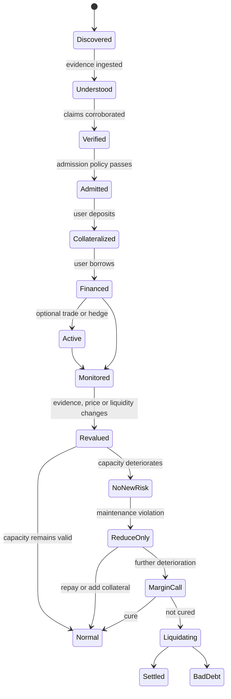
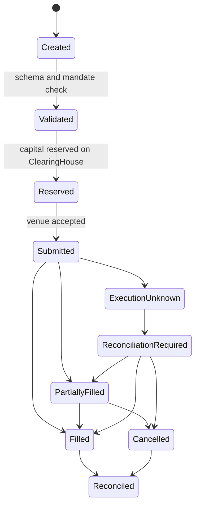

# spec/state-machines.md

Status: **frozen**.

Every asynchronous thing Usance does has a named state, and every named state has a user-facing
recovery. "Something went wrong" is not a state.

---

## 1. Asset lifecycle



`Understood → Verified` requires two independent extraction paths to agree. With only one path
available the asset may still be admitted, but the Passport is marked `singleSource` and the
policy caps what it can unlock (invariant I-17).

---

## 2. Account status

The total order from `accounting.md §5.1`:

```
NORMAL < NO_NEW_RISK < REDUCE_ONLY < MARGIN_CALL < LIQUIDATING < SETTLED < BAD_DEBT
```

| State | The user may | The user may not | Shown as |
|---|---|---|---|
| `NORMAL` | everything | — | Healthy |
| `NO_NEW_RISK` | repay, add collateral, withdraw within maintenance, close positions | borrow, open positions, increase leverage | No new risk |
| `REDUCE_ONLY` | repay, add collateral, close positions | borrow, open positions, withdraw | Reduce only |
| `MARGIN_CALL` | repay, add collateral | everything else | Action required |
| `LIQUIDATING` | add collateral if policy permits | everything else | Liquidating |
| `SETTLED` | withdraw residual equity | — | Settled |
| `BAD_DEBT` | — | — | Bad debt |

Transitions are recomputed on every read. There is no state-transition job whose failure would
leave an account mislabelled, and no cached status that could disagree with the inputs.

---

## 3. Transaction lifecycle (product surface)

```
IDLE
 → PREVIEW            deterministic quote, stamped with a risk epoch
 → APPROVAL_REQUIRED  only when an allowance is missing; a distinct signature with distinct copy
 → AWAITING_WALLET    the wallet has the request
 → SUBMITTED          broadcast, hash known
 → CONFIRMING         included, awaiting the confirmation depth policy requires
 → RECONCILING        chain state read back and compared with what was intended
 → COMPLETE           receipt written to Activity
```

Two failure branches, and the difference between them matters:

```
AWAITING_WALLET → REJECTED              nothing moved; return to the editable form
SUBMITTED       → CONFIRMATION_UNKNOWN  the RPC response was lost
```

`CONFIRMATION_UNKNOWN` resolves by looking the transaction up by identity. The user is never asked
to paste a hash, and the UI never offers a blind resubmit — a second signature after an unknown
first result is how people double-borrow.

`PREVIEW → POLICY_CHANGED` fires when the risk epoch moves between the quote and the signature.
The contract enforces it (invariant I-12); the UI catches the revert and re-quotes with a
before-and-after view rather than silently repricing.

---

## 4. External execution



Rules that hold at every edge:

1. Capital is reserved **before** submission and released **only** by reconciliation.
2. `ExecutionUnknown` releases nothing. Not knowing and not having happened are different states,
   and treating them the same is how a reservation gets freed for capital that is already spent.
3. A partial fill reconciles to exactly the filled amount; exactly the remainder is released
   (invariant I-24).
4. A duplicate or out-of-order venue observation has no incremental effect. `intentId` is consumed
   once (invariant I-20).

---

## 5. Crosschain collateral saga

Deposit:

```
CREATED → REMOTE_LOCK_PENDING → REMOTE_LOCKED → MESSAGE_PENDING
        → MESSAGE_VERIFIED → RECONCILIATION_PENDING → COLLATERAL_CREDITED → ACTIVE
```

Release:

```
RELEASE_REQUESTED → X_LAYER_OBLIGATION_CHECK → COLLATERAL_CREDIT_DISABLED
                  → REMOTE_RELEASE_AUTHORIZED → MESSAGE_PENDING → REMOTE_RELEASED → RECONCILED
```

`COLLATERAL_CREDIT_DISABLED` strictly precedes `REMOTE_RELEASE_AUTHORIZED`. The ordering is the
invariant: one lock, one credit, and never both live at once (invariants I-02, I-22).

The user is never asked for a message hash, a nonce, or a DVN identifier. The saga is followed by
its `CrosschainIntentId`, and `/app/activity/:receiptId` restores the current stage after a
refresh, a disconnect, or a week away.

---

## 6. Evidence and Passport

```
FETCHED → HASHED → CANONICALIZED → EXTRACTED → VALIDATED → CORROBORATED → COMMITTED
```

Branches:

```
EXTRACTED    → SCHEMA_INVALID   extraction is discarded; the Passport does not move
CORROBORATED → CLAIM_CONFLICT   extraction paths disagreed
             → SINGLE_SOURCE    only one path was available; capabilities are capped
```

`CLAIM_CONFLICT` is a restriction, never a coin flip between two readings. Usance does not
majority-vote its way to a fact about what an asset legally is. The asset keeps its existing
recognised value and stops being able to support new risk until the conflict is resolved by
evidence.
