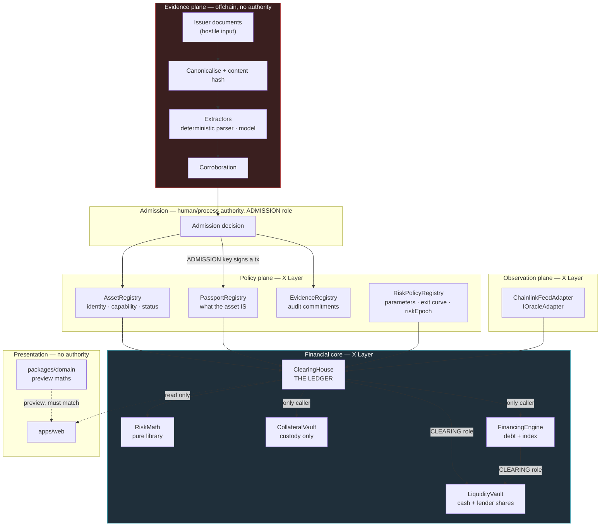
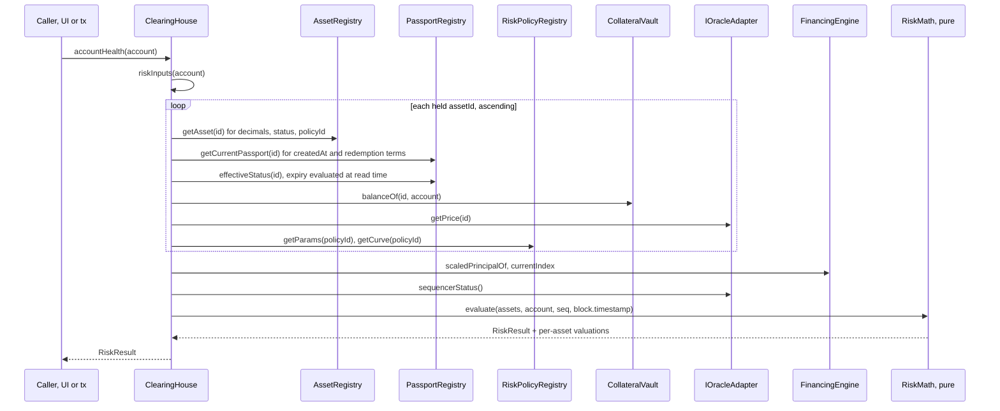
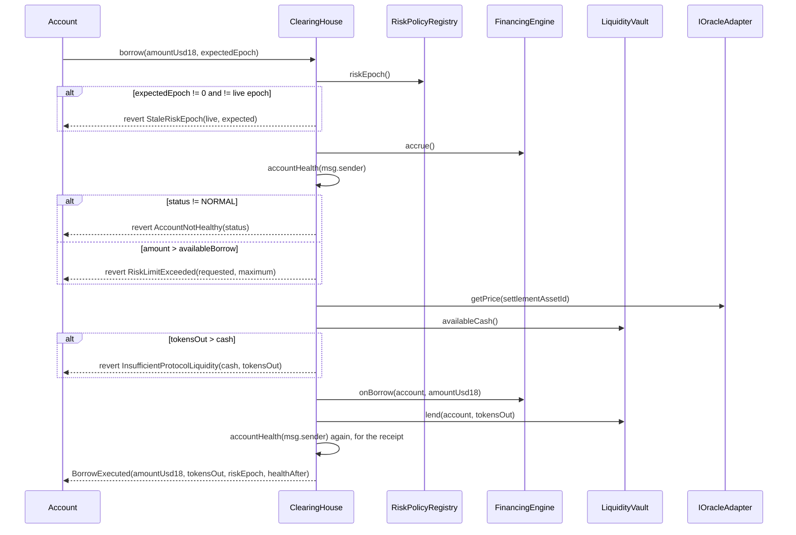
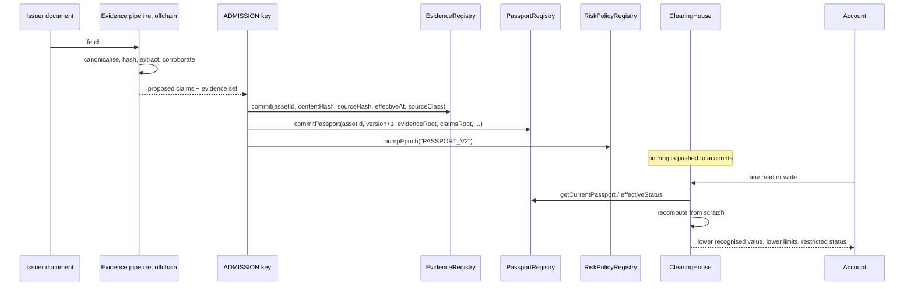

# spec/system.md — system architecture

Status: **frozen**. Changing a trust boundary or moving ownership of a fact requires an RFC in
`spec/rfcs/`.

This document answers one question: **what owns which truth, and what is allowed to cross which
boundary**. Formulas live in `accounting.md`, properties live in `invariants.md`, transitions live
in `state-machines.md`, adversaries live in `threat-model.md`. Nothing is restated here.

Rows marked **built** exist in the tree and compile today. Rows marked **specified** have a frozen
shape and no implementation. The distinction is kept visible in every table, because an
architecture document that describes an imagined system in the same voice as a real one is how a
team ends up integrating against something that was never written.

---

## 1. The single claim

> **`ClearingHouse` is the only owner of financial truth. Everything else either stores bytes on
> its instruction, or hands it an observation it is free to reject.**

Every consequence in this document follows from that sentence.

`CollateralVault` holds tokens and does not know what a Passport is. `FinancingEngine` carries debt
and cannot read a price. `RiskPolicyRegistry` publishes parameters and never looks at an account.
`ChainlinkFeedAdapter` reports what a feed said and has no opinion about whether that is good
enough. The only component that assembles all of it and decides is `ClearingHouse`, and it decides
by calling one pure function.

The corollary is the rule that governs every integration Usance will ever add:

> **An adapter translates. It never accumulates.**

The test is mechanical. If a component stores anything keyed by an account, it is a ledger, and
there is only one ledger. `ChainlinkFeedAdapter` stores `mapping(bytes32 assetId => Feed)` and
nothing else: no balances, no debt, no exposure, no per-account anything. A venue adapter that
starts tracking "how much this account has open with us" has become a second ledger, and two
ledgers that can disagree eventually will.

---

## 2. Planes and trust boundaries



Three properties of that picture are load-bearing:

1. **`EvidenceRegistry` has no outgoing edge into the core.** Nothing onchain reads it. It is a
   permanent audit commitment proving that the document you are shown later is the document that
   was priced. The thing the risk pipeline actually reads is `PassportRegistry`. Confusing the two
   is how an evidence store becomes a pricing oracle.
2. **The evidence plane reaches the chain only through a role-holding key.** A model produces a
   proposal. A key signs a transaction. Those are different events with different actors, and the
   gap between them is where I-15 lives.
3. **`packages/domain` has a dotted edge.** It computes, it renders, and if it ever disagrees with
   Solidity by one wei the build fails (`D-01`).

### Boundaries, precisely

| # | Boundary | What crosses | What is checked | Failure mode |
|---|---|---|---|---|
| B1 | wallet → `ClearingHouse` | user intent | `msg.sender` scoping, `nonReentrant`, epoch match, full risk re-evaluation | revert with a typed error carrying the exact maximum |
| B2 | `ClearingHouse` → `CollateralVault` / `FinancingEngine` | custody and debt instructions | `onlyClearingHouse`, address set once and immutable thereafter | revert `OnlyClearingHouse` |
| B3 | `ClearingHouse` / `FinancingEngine` → `LiquidityVault` | cash movement, interest recognition | `CLEARING` role, held by both | revert `Unauthorized` |
| B4 | Chainlink → `ChainlinkFeedAdapter` | price, timestamp, sequencer answer | `answer > 0`, `ts != 0`, `try/catch` around every external call | degrade to `(0, 0)`, which becomes `GATE_ORACLE_INVALID` |
| B5 | evidence pipeline → `PassportRegistry` / `EvidenceRegistry` | claims and commitments | `ADMISSION` role, sequential versioning, source-class ordering | revert; the previous Passport keeps standing |
| B6 | governance → `RiskPolicyRegistry` | parameter changes | `_validateParams`, `_validateCurve`, `_increasesRisk` routing to a 2-day timelock | queued, cancellable by a guardian |
| B7 | guardian → everything restrictive | status floors | enum ordinal comparison on every setter | revert; a guardian cannot express "less restrictive" |
| B8 | venue adapter → `ClearingHouse` | fills, cancellations | reservation budget, `intentId` consumed once | **specified**, not built |
| B9 | remote chain → X Layer | collateral lock proofs | DVN set per pathway, explicitly configured or refused | **specified**, not built |

---

## 3. Who owns what truth

| Fact | Owner | Where it lives | Who may write | State |
|---|---|---|---|---|
| Token custody balance | `CollateralVault` | `balanceOf[assetId][account]`, credited by **measured delta** | `ClearingHouse` only | built |
| Set of assets an account holds, ascending | `ClearingHouse` | `AccountState.held` | `ClearingHouse` on deposit/withdraw | built |
| Debt | `FinancingEngine` | `scaledPrincipalOf` × `borrowIndex` | `ClearingHouse` only | built |
| Borrow index and rate | `FinancingEngine` | `borrowIndex`, `rate` | itself on `accrue()`, governance on params | built |
| Settlement cash and lender claims | `LiquidityVault` | ERC-20 balance, `totalPrincipal`, `reserves`, `badDebt` | `CLEARING` role holders | built |
| Reservations | `ClearingHouse` | `AccountState.reservedUsd18` | `CLEARING` role | built |
| Guardian status floor | `ClearingHouse` | `AccountState.statusOverride` | guardian (raise), governance (clear) | built |
| Asset identity, decimals, capabilities, status | `AssetRegistry` | `AssetConfig` | `ADMISSION` (register, capabilities), `GOVERNANCE` (status, policy binding), `GUARDIAN` (restrict only) | built |
| What an asset **is** | `PassportRegistry` | `PassportHeader`, versioned, strictly sequential | `ADMISSION`; guardians may only restrict | built |
| Document provenance | `EvidenceRegistry` | `EvidenceCommitment` | `ADMISSION`; guardians may invalidate | built |
| Risk parameters and exit curve | `RiskPolicyRegistry` | `_params`, `_curves` | `GOVERNANCE`, timelocked when risk-increasing | built |
| `riskEpoch` | `RiskPolicyRegistry` | `uint64`, monotone | any policy write, plus `bumpEpoch` by `ADMISSION`/`GOVERNANCE`/`GUARDIAN` | built |
| Price and freshness | Chainlink | nothing stored by Usance | Chainlink | built |
| Sequencer liveness | Chainlink uptime feed | nothing stored by Usance | Chainlink | built |
| **Recognised value, limits, health, status** | **nobody** | **not stored** | **n/a** | built |

That last row is the point. `accounting.md §3` forbids a `recognizedCollateral` field, and there
is none. Every risk number is recomputed from live inputs on every read, so there is no cached
figure that can drift from the evidence and policy that justify it, and no keeper whose failure
leaves an account mislabelled.

---

## 4. Authority

One `Authority` contract, five roles, a flat `mapping(role => mapping(account => bool))`. An
authorization model nobody can hold in their head is one nobody audits.

| Role | May | May not |
|---|---|---|
| `GOVERNANCE` | change policy (timelocked when risk-increasing), grant and revoke every role, clear an account override, set the oracle adapter and settlement asset | bypass the timelock on a risk increase |
| `GUARDIAN` | restrict: suspend an asset, restrict a Passport, invalidate evidence, disable a feed, floor an account's status, cancel a queued risk increase | raise an LTV, lower a haircut, create debt, move collateral, redirect a withdrawal, lift any restriction |
| `ADMISSION` | register assets, set capabilities, commit Passports and evidence, bump the epoch | touch custody, debt, cash or risk parameters |
| `CLEARING` | move vault cash, reserve and release capital | anything a user does |
| `LIQUIDATOR` | run liquidation routes | **specified**; no contract consumes this role yet |

`Authority` stores roles in an open `mapping(bytes32 role => mapping(address => bool))`, so a new
contract can define its own role constant and have it granted through the existing governance path
without touching `Authority`. `IntentBook.EXECUTOR` is the first of those, and it is deliberately
not `CLEARING`: `CLEARING` can move vault cash, and handing that to whatever observes a venue would
make an execution adapter a custody participant.

The guardian restriction is structural, not procedural. Every guardian-reachable setter compares
enum ordinals:

```solidity
require(uint8(status) > uint8(st.statusOverride), "override may only restrict");   // ClearingHouse
require(uint8(status) > uint8(p.status), "restrict may only move downward");       // PassportRegistry
require(uint8(status) > uint8(_assets[assetId].status), "guardian may only restrict"); // AssetRegistry
if (uint8(next.sourceClass) < uint8(prev.sourceClass)) revert WeakerSource(...);   // EvidenceRegistry
```

A guardian key that is fully compromised can freeze Usance. It cannot make anyone poorer than
frozen. That asymmetry is the entire emergency design.

---

## 5. The read path

Every number the product shows comes out of this, and so does every number the contract enforces.



Four things this diagram is asserting:

- **Nothing is cached.** `riskInputs` is a view that reads every field live from its owning
  registry. Caching any part of it would let a decision be made under inputs that no longer hold,
  which is the exact failure `riskEpoch` exists to make impossible.
- **The held-asset list arrives sorted.** `_insertHeld` maintains ascending order at write time,
  and `RiskMath.evaluate` reverts `AssetsNotOrdered` rather than trusting it. Truncated sums are
  order-dependent (`accounting.md §1.3`), so an unsorted array is a silently different total.
- **`RiskMath.evaluate` is `pure`.** It reads no storage, no block state, no oracle. That is what
  lets `fixtures/canonical/risk-scenarios.json` drive it directly and what lets the TypeScript and
  Python transcriptions be genuine differential oracles rather than approximations.
- **A dead oracle does not brick an account.** `getPrice` wraps the aggregator in `try/catch` and
  returns `(0, 0)` on revert. That becomes `GATE_ORACLE_INVALID`, which blocks new risk while
  leaving repayment and collateral top-ups available.

---

## 6. The write path



The ordering is deliberate and is itself a specification:

1. **Epoch check first.** Cheapest, and it is the one failure the user must be told about before
   anything else moved. `expectedEpoch == 0` opts out, which exists for scripts and for the first
   transaction of a session; the UI always passes a real epoch.
2. **Accrue before evaluating.** A quote computed against a stale index is a quote that is
   cheaper than the transaction which follows it.
3. **Risk before liquidity.** Two constraints with two different remedies. "Add collateral" and
   "wait for lenders" are not the same advice, so `availableBorrow()` returns
   `(amount, limitedByLiquidity)` and the UI says which one is binding.
4. **Debt before cash.** Effects before interactions, on a settlement token that may call back.

`withdrawCollateral` follows the same shape with one difference worth stating: it re-simulates the
entire post-withdrawal portfolio rather than linearising. Recognised value is not linear in
quantity, because the exit curve is a step function and concentration caps interact, so a closed
form would be wrong at exactly the tier boundaries where users push. `maxWithdrawable` binary
searches that same simulation for at most 128 iterations, which costs nothing offchain and means
the number the UI shows is a number the contract will accept.

---

## 7. The evidence-to-capacity path

This is the mechanism the protocol exists for, and it runs with no keeper and no manual state
edit.



`contracts/test/Lifecycle.t.sol::test_passportUpdateChangesCapacityAndBlocksNewRisk` runs exactly
this. A Passport v2 lands with `redemptionFloorBps` cut from 9,900 to 6,000, recognised value on a
1,000-token position falls to `600e18` because the redemption floor becomes the binding term of
the `min()`, `availableBorrowUsd18` goes to zero, and the next `borrow(1e18, 0)` reverts
`AccountNotHealthy`. No account was iterated. No job ran. The pipeline is pull-based because a
push-based one has a queue, and a queue has a backlog, and a backlog means some accounts are
priced under last week's evidence.

---

## 8. Determinism boundary

`RiskMath` is the boundary. Above it, contracts read storage and talk to the world. Below it,
everything is a pure function of an argument list.

| Property | Consequence |
|---|---|
| `pure`, no storage, no `block.*` | fixtures drive it directly, with no harness in between |
| every input materialised into `Types.AssetRiskInput[]` | the same struct crosses Solidity, TypeScript and Python identically |
| 512-bit intermediates in `mulDiv` | a large position values correctly instead of reverting on overflow |
| ordering asserted, not assumed | `AssetsNotOrdered` rather than a quietly different sum |
| enum ordinals frozen in `Types.sol` | changing one is an RFC, because three implementations encode them |

`make test-differential` regenerates the fixtures from `scripts/gen_fixtures.py`, compares them by
content against what is committed, and then runs the Solidity, TypeScript and Rust conformance
suites against the result. A one-wei disagreement is a failing build.

`accounting.md` and `invariants.md` both record a deviation here: they name `crates/risk-core` as
the third implementation and state that it is not written, with `scripts/gen_fixtures.py` filling
the role. That gap is being closed in the same session as this document. A root `Cargo.toml` and
`crates/risk-core` now exist, and the Rust conformance suite runs under `make test-differential`
alongside the other two. The deviation notes in those two files are stale in Usance's favour and
should be revised by RFC rather than assumed.

---

## 9. Deployment topology

`contracts/script/Deploy.s.sol` deploys ten contracts in dependency order, wires them, registers
the settlement asset, and hands governance away from the deploy key. It refuses to run anywhere
that is not X Layer:

```solidity
if (block.chainid != 196 && block.chainid != 1952) revert WrongChain(block.chainid);
```

Everything environment-specific arrives through the environment (`USANCE_SETTLEMENT_TOKEN`,
`USANCE_SETTLEMENT_FEED`, `USANCE_SEQUENCER_FEED`, `USANCE_GOVERNANCE`, `USANCE_GUARDIAN`). No
developer path and no RPC URL is hardcoded in any contract, script or test.

Two facts about wiring that are easy to get wrong and are settled here:

- `CollateralVault.clearingHouse` and `FinancingEngine.clearingHouse` are **set once** and revert
  on a second write. Custody that can be repointed is custody that can be repointed by whoever
  takes the governance key.
- `LiquidityVault` grants `CLEARING` to **both** `ClearingHouse` and `FinancingEngine`, because the
  first moves cash and the second recognises interest. Hardcoding one address would lock the other
  out the first time interest accrued.

**Nothing is deployed.** `deployments/manifest.ts` exports an empty record, and `/app` says so in
plain language rather than rendering an empty portfolio that looks like a funded account. Price
sources are Chainlink **Data Feeds**, verified live on X Layer mainnet on 2026-08-17. Chainlink
**Data Streams** is not deployed on X Layer at all: the registry lists X Layer with
`supportedFeatures: ["feeds"]` and every X Layer product carries `deliveryChannelCode: "DF"`.
`docs/INTEGRATIONS.md` holds the transcript.

---

## 10. What is built

| Component | Path | State |
|---|---|---|
| `Authority` | `contracts/src/core/Authority.sol` | built |
| `AssetRegistry` | `contracts/src/core/AssetRegistry.sol` | built |
| `EvidenceRegistry` | `contracts/src/core/EvidenceRegistry.sol` | built |
| `PassportRegistry` | `contracts/src/core/PassportRegistry.sol` | built |
| `RiskPolicyRegistry` | `contracts/src/core/RiskPolicyRegistry.sol` | built |
| `CollateralVault` | `contracts/src/core/CollateralVault.sol` | built |
| `LiquidityVault` | `contracts/src/core/LiquidityVault.sol` | built |
| `FinancingEngine` | `contracts/src/core/FinancingEngine.sol` | built |
| `ClearingHouse` | `contracts/src/core/ClearingHouse.sol` | built |
| `RiskMath`, `Types` | `contracts/src/libraries/` | built |
| `ChainlinkFeedAdapter`, `IOracleAdapter` | `contracts/src/adapters/`, `contracts/src/interfaces/` | built |
| TypeScript risk preview | `packages/domain/src/risk.ts` | built |
| X Layer config, ERC-8021 builder codes | `packages/xlayer/src/` | built |
| Fixture generator | `scripts/gen_fixtures.py` | built |
| `MandateRegistry`, `IntentBook`, `EmergencyController` | `contracts/src/core/` | built this session |
| Rust reference engine | `crates/risk-core/` | built this session, runs under `make test-differential` |
| `LiquidationManager`, `FeeController` | — | **specified only** |
| `RemoteAssetEscrow`, `LayerZeroCollateralAdapter`, `ExchangeOSAdapter`, `OkxDexAdapter`, `XStocksAdapter`, `CashTransportAdapter`, `ChainlinkStreamsAdapter` | — | **specified only** |
| Evidence services (`services/evidence`, `packages/chaingpt`, `packages/schemas`) | empty directories | **specified only** |

`spec/interfaces.md` carries the frozen shapes for everything in the last four rows.

---

## 11. Recorded divergences

Recorded rather than quietly carried, in the style `accounting.md` and `invariants.md` use. None
of these is fixed by this document; each is a defect or a gap with a named location.

**D-S1. `LiquidityVault.totalPrincipal` mixes units.** `ClearingHouse.borrow` calls
`liquidity.lend(msg.sender, tokensOut)` with a settlement-token amount (6 decimals for USDC), so
`totalPrincipal` accumulates in token units. `ClearingHouse.repay` calls
`liquidity.onRepaid(applied, 0, 0)` with `applied` in `usd18`. On a 6-decimal settlement asset the
repayment figure is 10^12 times larger than the principal figure, so the first repayment drives
`totalPrincipal` to zero. `totalAssets()` and `utilizationBps()` inherit the same mismatch, and so
does `FinancingEngine.currentRateBps`, which compares `availableCash()` in token units against
`totalBorrowsStored()` in `usd18` and therefore reads utilisation as effectively 100% as soon as
any debt exists. Fee conservation (`accounting.md §7`, invariant `I-06`) has no test yet, which is
why this is not currently caught.

**D-S2. Accrued interest is recognised and never settled.** `FinancingEngine.accrue()` increments
`LiquidityVault.accruedReceivables`. `ClearingHouse.repay` passes `interest = 0` and
`reserveFactorBps = 0` to `onRepaid`, so receivables never decrease and `reserves` are never
funded from the spread despite `RateParams.reserveFactorBps` being configured (10% in both
`Deploy.s.sol` and the test fixture).

**D-S3. `FinancingEngine.onRepay` does not emit on the full-clear path.** The `repayAll ||
amountUsd18 >= outstanding` branch returns before `emit Repaid`. Indexers reconstructing debt from
events will miss every full repayment.

**D-S4. Withdrawal does not consult account status.** `state-machines.md §2` says a `REDUCE_ONLY`
account may not withdraw. `ClearingHouse.withdrawCollateral` checks only that the post-withdrawal
`debt <= maintenanceLimit` and that no reservation is outstanding. Where `REDUCE_ONLY` arises from
debt, the maintenance check refuses the withdrawal anyway. Where it arises from a guardian
override on an account with no debt (fixture `S19`), the withdrawal is permitted by the contract
and forbidden by the table.

**D-S5. Reservation scope.** `accounting.md §5.2` writes the withdrawal precondition as
`reservedUsd18 == 0` *for that asset*. Reservations are stored per account
(`AccountState.reservedUsd18`), and the contract blocks a withdrawal of any asset while any
reservation is outstanding. Stricter than the text, and the text has no per-asset field to refer
to.

**D-S6. Timestamp skew reverts in Solidity and does not in TypeScript.** `RiskMath.assetGates`
computes `nowTs - a.priceUpdatedAt` in checked arithmetic, so a feed reporting a timestamp in the
future reverts the whole evaluation. `packages/domain/src/risk.ts` computes the same expression in
`number` arithmetic, gets a negative value, and raises no gate. No canonical fixture carries a
future timestamp, so `D-01` does not cover it.

**D-S7. `singleSource` is recorded and never read.** `PassportRegistry.PassportHeader.singleSource`
is stored and emitted. No contract reads it, and it is not a field of `Types.AssetRiskInput`.
Invariant `I-17` therefore rests entirely on the admission process withholding
corroboration-gated capabilities, which is policy, not arithmetic. `invariants.md` already marks
`I-17` as planned; this names where the enforcement would have to live.

**D-S8. Path drift in `docs/INTEGRATIONS.md`.** It cites
`packages/xlayer/src/builderCode.ts`; the file is `packages/xlayer/src/builder-code.ts`.
